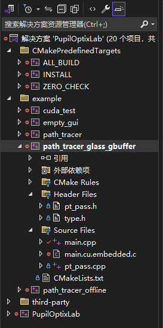

## transparent-gs-optix

This framework is originally developed by [mchenwang](https://github.com/mchenwang) for his research on ray tracing algorithms on GPU with Optix7, the original code is hosted on [PupilOptixLab](https://github.com/mchenwang/PupilOptixLab).

## Prerequisites

- CMake 3.25.2+ (to support `-std=c++20` option for nvcc)
- Visual Studio 2022
- NVIDIA graphics card with OptiX7 support
- CUDA 12.0+ (tested on 12.1)
- OptiX 7.5 (for the built-in sphere intersection and higher versions are currently not supported due to APIs changes)

## File Structure

```
example/
│── path_tracer_glass_gbuffer/
│   ├── main.cpp            <--set dataset path here
│   ├── ...
├── data/
│   ├── static/
│   │   ├── <dataset>/
│   │   │   ├── xmls/       <--put xmls here
│   │   │   │   ├0001.xml
│   │   │   │   ├0002.xml
│   │   │   │   ├...
│   │   │   ├── gbuffers/   <--outputs
│   │   │   │   ├0001_normal.exr
│   │   │   │   ├0001_reflect_direction.exr
│   │   │   │   ├0001_reflect_position.exr
│   │   │   │   ├0001_refract_direction.exr
│   │   │   │   ├0001_refract_position.exr
│   │   │   │   ├0002_normal.exr
│   │   │   │   ├...
│   │   ├── meshes/ 
│   │   │   ├── <dataset>.ply <--put models here
```

## Usage
1.First use cmake to generate the project files, then compile the project **path_tracer_glass_gbuffer** in the **example** directory.  
  
2.Copy xml files into the **xmls** directory and models into the **meshes** directory.  
3.In the **main.cpp** file, set the dataset path to the directory containing the xmls and models.
```
std::filesystem::path root_folder_path = "../../../data/static/dolphin32";  //write your dataset path
```

4.Then run the project and the results will be saved in the **gbuffers** directory.